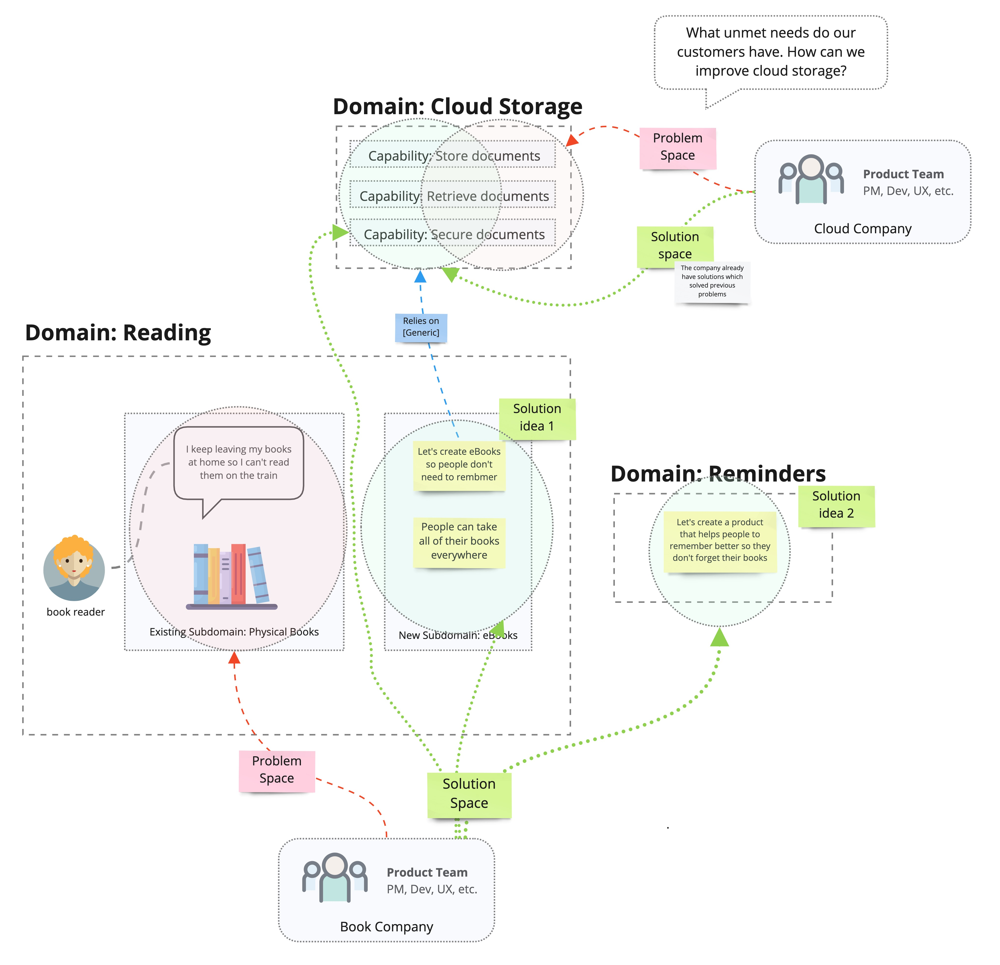

# [Experimental] Strategic DDD Architecture Building Blocks

## Problem Space vs Solution Space: Example Scenario

Book Company's mission is to improve every aspect of reading. They have noticed that many readers are frustrated when they forget to take books with them when they leave the house and can't read their books while commuting. 

>Physical Books (subdomain) is part of problem space for Book Company

Book Store explores two possible solutions: an app to help remind readers, and ebooks which enable readers to take their books everywhere, so they don't need to worry about remembering them.

>eBooks and Reminders (domains) are part of solution space for Book Company. They are proposed solutions not existing solutions

To build eBooks and enable readers to read their books across all devices and never lose them, the eBooks will  be stored in the cloud. The ability to store and retrieve documents in the cloud are concepts in the Cloud Storage domain.

>Cloud Storage (domain) is part of the solution space for Book Store

Cloud Company already provides cloud storage. They have an existing cloud storage solution which has active customers. 

>Cloud Storage (domain) is part of the solution space for Cloud Company

Cloud Company is also looking to grow their customer base and improve their cloud storage solution. They are looking for further unmet user needs in the Cloud Storage domain.

>Cloud Storage (domain) is part of problem space for Cloud Company. It is therefore part of both their problem and solution space.

## The Domains are the Landscape

The problem and solution spaces are not isolated, independent worlds. They are viewer-dependent views of the same landscape.

"what's a solution space for one, is the problem space for another." -- Mathias Verraes

When new solutions are built they modify the existing landscape. They may change existing domains or they may create entirely new domains. In Simon Wardley's Strategy writings, this is a climatic pattern: [Higher-Order Systems Create New Sources of Worth](https://medium.com/wardleymaps/exploring-the-map-ad0266fad59b).

"Genesis begets evolution begets genesis." -- Simon Wardley

When a problem is solved, the solution creates new problems and opportunities.