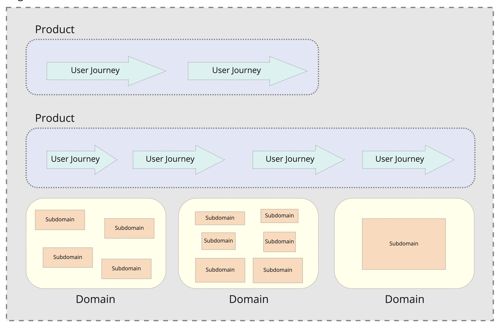
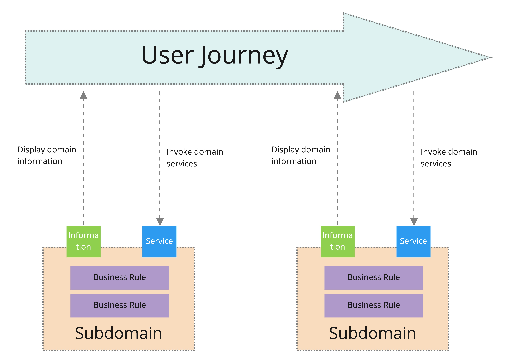
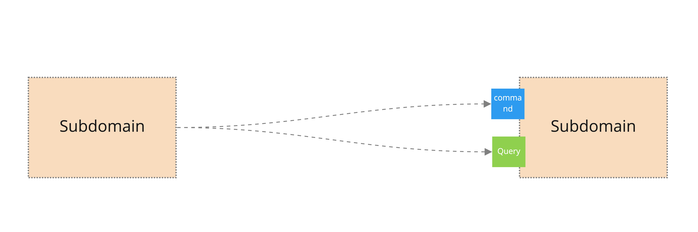
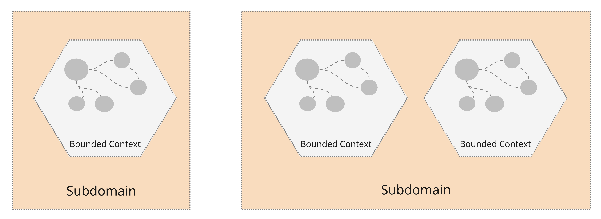
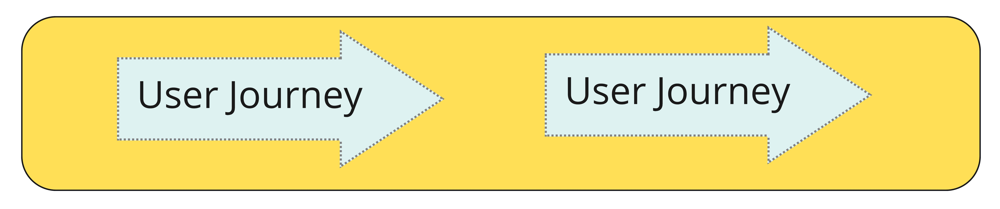
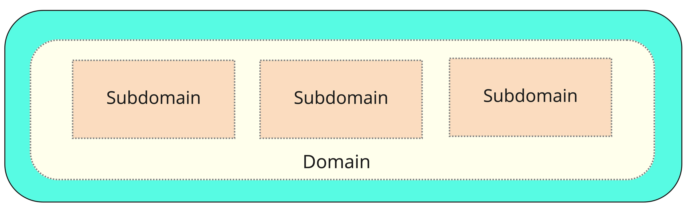
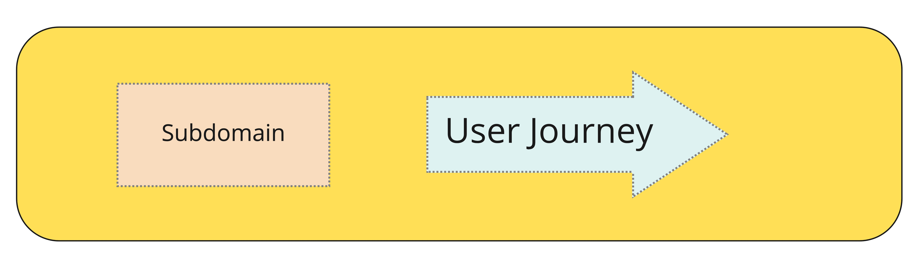

# [Experimental] Strategic DDD Architecture Building Blocks

This repository catalogues a language for describing architectural concepts from a Strategic Domain-Driven Design perspective.

The goal of this repository is to create a shared language that practitioners can apply consistently across projects and domains. Less ambiguity should equally benefit newcomers to DDD and experienced practitioners.

> This model is a constant WIP in progress. If you have suggestions, or you have a scenario that doesn't fell well with this model, please raise a pull request or an issue.

## Organisation

An organisation delivers it's value propositions to customers by providing one or more products. 

### Product

A product is a cohesive user experience composed of one or more user journeys that represent domain concepts.

### Domain

A domain is a logical area the business operates in containing business rules and business processes. Domains are composed of one or more subdomains.

## Subdomains and User Journeys

A user journey is typically a series of pages or screens a user steps through to achieve a specific outcome.

Each step of a user journey presents information from a subdomain(s) and/or invokes services of a subdomain(s) which apply business rules.

### Subdomain Interactions

Some steps in business processes are automated (not triggered by a human) and may require subdomains to interact. There are 3 types of messages that subdomains use to communicate with each other.

#### Queries

A subdomain may request information from another subdomains.

#### Commands

A subdomain may invoke services on another subdomain by sending it a command.

#### Events

A subdomain my publish notifications to one or more subscribing subdomains about events that have occurred in the domain.

## Bounded Contexts

A bounded context is a specialised model representing domain concepts and their relationships within a subdomain. A subdomain may contain one or more bounded contexts.

A sensible default is to aim for a 1:1 mapping between subdomain.

### Ubiquitous Language

Each bounded context has it's own Ubiquitous Language - a glossary of terms, where the definition applies only within the bounded context.

## Team Topologies

Team Topologies is a model for describing teams within an organisation.

### 4 Team Types

### Team Responsibilities

Each team in an organisation (except enabling teams) are responsible for one or more subdomains or user journeys.

Some teams may be focused more on user experience, responsible for only user journeys.

Some teams may be focused on providing information and services, responsible for only subdomains.

Some teams may own a mixture of user journeys and subdomains.

